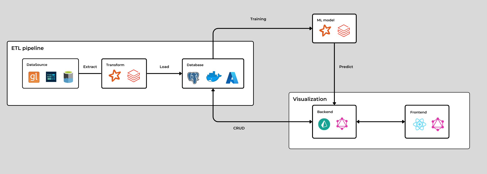

# Project: Movies Recommendations System

## Introduction

A movie recommendation website uniting personalized experiences and interactive ratings. Beginning with a user movie
ratings dataset, the project evolves into a full-fledged platform, encompassing crucial Data Engineering tasks. By
integrating potent Machine Learning models.

The frontend, crafted with React, offers an immersive user interface. Behind the scenes, Graphql and Prisma power the
backend for efficient data management.

Remarkably, the project boasts two versions. The cloud version on Azure orchestrates the pipeline, database, and Machine
Learning models through Azure DataBricks and Azure PostgreSQL. Meanwhile, a local version using Docker Compose empowers
resource control and streamlined deployment.

This project encapsulates my journey as a learner, showcasing theory transforming into a practical, professional
pursuit.

## Operation

### Database & ETL pipeline:

Got 2 versions

| Aspect            | Local Version                                                                                                                                                                         | Cloud Version                  |
|-------------------|---------------------------------------------------------------------------------------------------------------------------------------------------------------------------------------|--------------------------------|
| Resources         | Jupyter Notebook                                                                                                                                                                      | Azure Databricks               |
| Source            | [`database/local/blob/` folder](database/local/blob)                                                                                                                                  | Azure Blob Storage (Data Lake) |
| Sink              | [Local PostgreSQL](database/local/data)                                                                                                                                               | Azure PostgreSQL               |
| Secret Management | `.env` files                                                                                                                                                                          | Azure Key Vault                |
| Database Init.    | Docker Compose                                                                                                                                                                        | Manual Query Execution         |
| Data Source       | [Grouplens Dataset](https://grouplens.org/datasets/movielens/latest/) for User Ratings,  [TMDB API](https://developer.themoviedb.org/reference/intro/getting-started) for Details | Same                           |

### Backend:

- Prisma automate GraphQL types and CRUD resolvers from the database schema.
- Utilize Apollo GraphQL Sandbox when developing.
- Note: Error may occur by ManyToMany relations resolver that need manually fixed.

### Frontend:

- GraphQL CodeGenerator generate query types and fragments.

### ML model:

- ALS (Alternating Least Squares) algorithm for collaborative filtering.
- Predict user ratings for movies they haven't yet watched, forms the basis for personalized movie recommendations
- Accuracy, evaluated using Root Mean Square Error (RMSE) with cross-validation, is approximate value of 0.81
- As user engagement increases, the model will be retraining to fit with dataset.

## Lessons Learned

## Contact